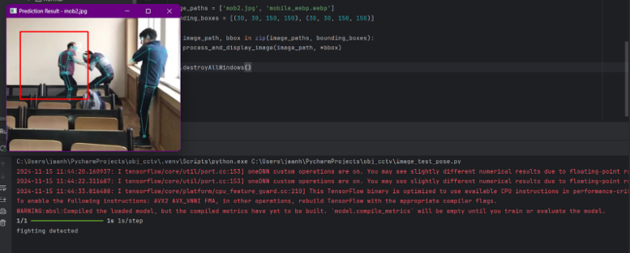
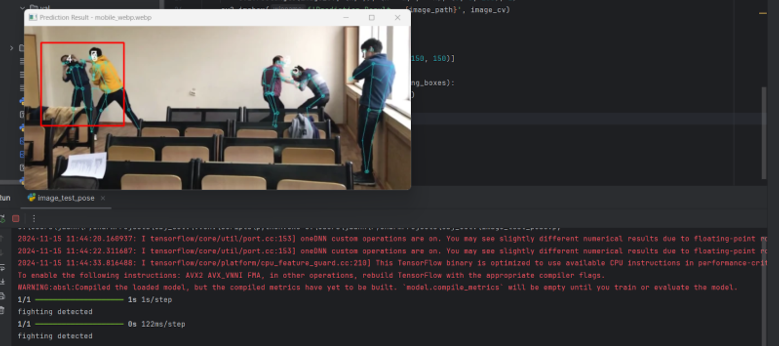

# Assault Detection using Computer Vision

## Abstract
The advancements in artificial intelligence (AI) and computer vision have enabled numerous real-world applications, including security and surveillance systems. This project introduces a robust system for detecting physical assault in surveillance footage by leveraging a combination of YOLO-Pose for skeletal pose estimation and a deep learning classifier based on ResNet50. The model was trained on 468 labeled RGB images with corresponding skeletal data to distinguish assault scenarios from non-assault scenarios effectively. This system aims to provide real-time detection capabilities to enhance public safety and support law enforcement.

## Chapter 1: Introduction
- Public safety concerns necessitate innovative solutions for identifying violent incidents promptly.
- Traditional systems rely on human monitoring, which is prone to errors; integrating AI allows for automated and accurate violence detection.
- The project focuses on using pose estimation and deep learning for real-time assault detection from surveillance footage.

## Chapter 2: Literature Survey
| Sr. No. | Paper Title                          | Methodology                                     | Advantages                               | Issues / Research Gap                               |
| ------- | ------------------------------------- | ----------------------------------------------- | ---------------------------------------- | -------------------------------------------------- |
| 1.      | Real-Time Human Pose Detection with YOLO | Utilized YOLO for pose detection and skeletal mapping. | Fast and accurate pose extraction.      | Struggles with occluded body parts in crowded scenes. |
| 2.      | Deep Learning Techniques for Violence Detection | Applied CNNs for violent activity classification. | High accuracy for isolated events.       | Requires large datasets for generalization.        |
| 3.      | ResNet Applications in Image Recognition | Used ResNet for hierarchical feature extraction. | Excellent for complex image tasks.       | Computationally expensive for real-time.           |
| 4.      | Hybrid AI Models for Action Recognition | Combined CNNs and RNNs for temporal activity analysis. | Effective for sequential data.           | Not optimized for static image-based tasks.         |

## Objectives
- Develop an AI system capable of real-time assault detection from surveillance footage.
- Use YOLO-Pose for skeletal pose extraction.
- Build a deep learning model with ResNet50 for binary classification of assault actions.
- Evaluate the system's performance under different conditions like lighting and occlusion.

## System Architecture

### Overview of System Workflow:
1. **Input Stage:** RGB frames from surveillance cameras.
2. **Pose Estimation:** Skeleton mapping with YOLO-Pose for key joint coordinates.
3. **Preprocessing:** Resizing, normalization, and preparation of skeletal pose data.
4. **Classification:** Prediction of "assault" or "non-assault" using ResNet50.
5. **Output:** Visual alerts and bounding box annotations.

## Methodology

### Dataset Preparation
- 468 labeled images categorized into "assault" and "non-assault" with corresponding skeletal annotations generated using YOLO-Pose.
- Dataset split: 80% for training, 20% for validation.

### Preprocessing
- Resized RGB images to 224x224 pixels.
- Pixel normalization to the range [0, 1] for training.
- Data augmentation applied: horizontal flipping, shearing, zooming.

### Model Design
- **Pose Estimation:** YOLO-Pose (YOLOv8) for skeleton data extraction and bounding boxes.
- **Classification:** ResNet50, pretrained on ImageNet with custom top layers.
  - Global Average Pooling layer.
  - Fully connected Dense layer with 1024 neurons and ReLU activation.
  - Output layer with sigmoid activation for binary classification.

### Training
- **Optimizer:** Adam
- **Loss Function:** Binary Cross-Entropy
- **Batch Size:** 32
- **Epochs:** 10 (early stopping used)

### Training Performance
- **Test Loss:** 0.4521  
- **Test Accuracy:** 79.3%  
- **AUC:** 0.8912  
- **Precision:** 0.81  
- **Recall:** 0.77

### Observations
- Model performs well in detecting violent actions.
- Challenges include occlusion and poor lighting conditions.
- 
- 

## Uses / Applications
- **Public Surveillance:** Detecting violent incidents in real-time at events, transport hubs, etc.
- **Law Enforcement:** Assisting in proactive monitoring and threat detection.
- **Forensic Analysis:** Automating the analysis of video evidence.
- **Private Security:** Enhancing safety in private and corporate settings.

## Conclusion
- The assault detection system integrates pose estimation and deep learning for accurate violent action detection.
- Challenges like performance in low-light conditions and crowded environments are noted, and further research will aim to optimize the model for real-time applications.

## References
- Wang, L., Ning, H., Tan, T. "Fusion of Static and Dynamic Body Biometrics for Gait Recognition." IEEE Trans. on Circuits and Systems for Video Technology, 14(2), 149–158 (2004).
- Marr, B., "15 Amazing Real-World Applications of AI Everyone Should Know About," Forbes, May 2023.
- Redmon, J., Farhadi, A. "YOLOv3: An Incremental Improvement," arXiv preprint arXiv:1804.02767 (2018).
